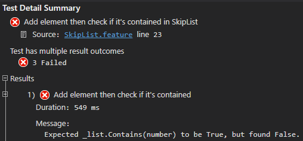

# Documentation of BDD tests

The main goal was to improve the coverage of classes which had few to no test beforehand.

The following classes were BDD tested with 43 individual test scenarios altogether:

| Class          | Scenarios | Pass |
|----------------|:---------:|:----:|
| QuickSorter    |     1     |   ✔  |
| GnomeSorter    |     3     |   ✔  |
| CliqueGraph    |     5     |   ✔  |
| OddEvenSorter  |     5     |   ✔  |
| CycleSorter    |     3     |   ✔  |
| ArrayList      |     12    |   ✔  |
| CatalanNumbers |     8     |   ✔  |
| SkipList       |     6     |   ❌  |

All the classes passed the BDD test except `SkipList`. It produced non-deterministic behavior when adding elements and retrieving them.

## SpecFlow

The BDD tests were written in [Gherkin](https://cucumber.io/docs/gherkin/) language using the [SpecFlow](https://docs.specflow.org/projects/specflow/en/latest/) Visual Studio Plugin.  
They were run using [SpecFlow + Runner](https://docs.specflow.org/projects/specflow-runner/en/latest/?_gl=1*1pavx2b*_ga*MTgwMjQzMTcyMy4xNjIwNzM3Njk0*_ga_BZ55XKTXC6*MTYyMTE2ODMyMi4xNy4wLjE2MjExNjgzMjIuMA..&_ga=2.261431693.1842048322.1620737694-1802431723.1620737694).


## How do the tests work?

The BDD tests are defined in `.feature` files.  
These consist of different scenarios each containing a test definition written in Gherkin so it is human readable.

Every `.feature` file has a corresponding `StepDefinitions.cs` file.  
Every line of Gherkin step can be matched to a function in this `StepDefinitions.cs` file defining what that step exactly does.

`StepDefinitions` can be executed with the .NET SDK, so when a BDD test is run each step calls the appropriate step definition function.

## Fluent Assertions

Since one goal of BDD testing is to encourage non-technical or business participants in a software projects good readability is important.

FluentAssertions help make the code more readable, that's why it is used in the step definitions.

Example:  
`_range.Should().BeEquivalentTo(expectedRange);`

## Sorters

Sorters are tested if their sorting results in the correct order.

```Gherkin
@sortAscending
Scenario: QuickSorter integer list sorting
	Given the random seed is 42
	And a random list of length 100000 is generated
	When the list is sorted
	Then the list should be in ascending order
```

`QuickSorter` only has 1  ascending sort method, that's why it only has 1 scenario.  
The other sorters were tested for both explicit ascending/descending sorting and implicit ascending sorting too.

`OddEvenSorter` was tested with sorting lists of integers and lists of randomly generated strings with a given length too.

```Gherkin
@sortDescending
Scenario: OddEvenSorter string list explicit descending sorting
	Given the random seed is 21632
	And the length of strings is 10
	And a random list of strings is generated with length 10000
	When the string list is sorted descending
	Then the string list should be in reversed alphabetical order
```

## CliqueGraph

Represents an unweighted undirected graph.

Here instantiating the graph and adding vertices were tested.
Instantiating with null was handled well.

```Gherkin
@instantiate
Scenario: Instantiate with null
	When a graph is instantiated with null
	Then getting the graph's vertices should return null
```

During testing the `AddVertices` method we faced some issues.  
In Gherkin when we passed the vertices as a list it resulted in some unexpected exception. With the help of @AkosUzonyi we managed to solve it by passing the list as a single string and splitting it in the step definition function.

We concluded that the intended way is to pass an array instead.

```Csharp
[When("these vertices are added (.*)")]
public void WhenTheseVerticesAreAdded(string vertices)
{
	_cliqueGraph.AddVertices(vertices.Split(","));
}
```

## ArrayList

This class received most of the tests. Many __boundary values__ were not tested yet, so I focused on covering these.

There are several tests similar to this checking if `IndexOutOfRangeException` or `ArgumentOutOfRangeException` were thrown at the right places.

```Gherkin
@outOfRange
Scenario: Instantiate with 0 capacity and get first
	Given the capacity is 0
	And the array list is created
	When the first element is accessed
	Then the result should be IndexOutOfRangeException
```

## SkipList

The tests uncover mistakes in this class.

The `Add` function doesn't consistently add elements to the list.
Calling `Contains` with the added element often returns `False`.  
The list's `Count` property also shows that no element was added.

### Adding an element and checking if the list contains it

```Gherkin
@add
Scenario: Add element then check if it's contained
	Given a new list is created
	And the following element is added: 42
	Then the list should contain 42
```

Step definitions for the test:

```Csharp
private SkipList<int> _list;

[Given("a new list is created")]
public void GivenANewListIsCreated()
{
	_list = new SkipList<int>();
}

[Given("the following element is added: (.*)")]
public void GivenTheFollowingElementIsAdded(int element)
{
	_list.Add(element);
}

[Then("the list should contain (.*)")]
public void ThenTheListShouldContain(int number)
{
	_list.Contains(number).Should().Be(true);
}
```

The test result gives different results if executed multiple times.


