# SonarLint 
 With SonarLint we could detect and fix issues during development. The product has thousands of static code analysis rules to help improve the quality of code. With the help of the program We detected common mistakes and fixed those with the suggested solutions.

The error list is visible on the image below:

 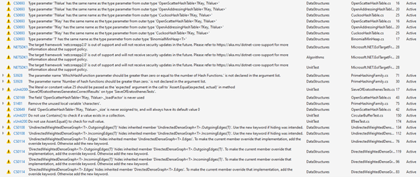

## Errors addressing TKey, TValue

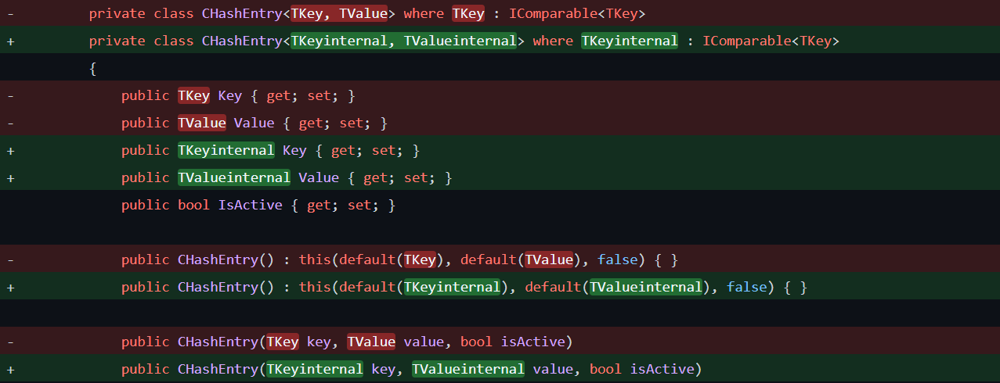

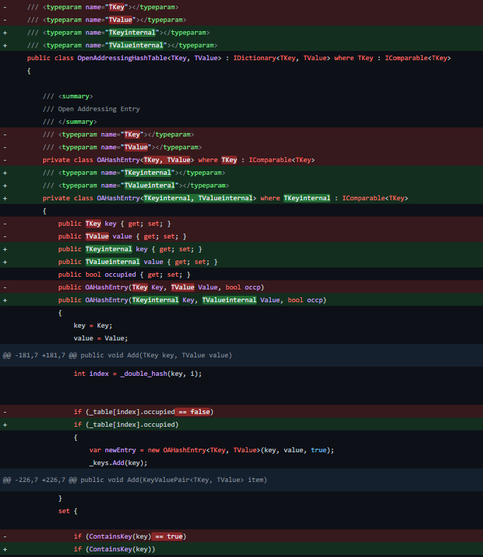

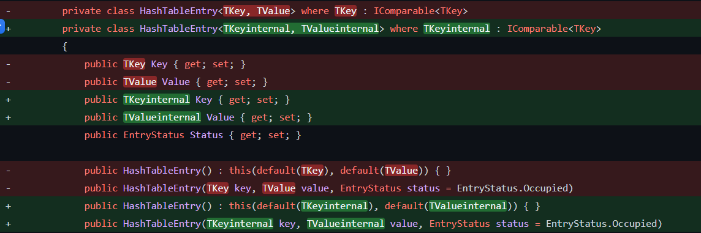

The TValue and TKey parameters have the same name as the type parameter from the outer type. To fix this we 
renamed the parameters to make the code more readable.
- CuckooHashTable.cs 
- OpenAddressingHashTable.cs 
- OpenScatterHashTable.cs 

## Errors addressing unused variables 

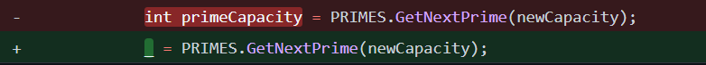

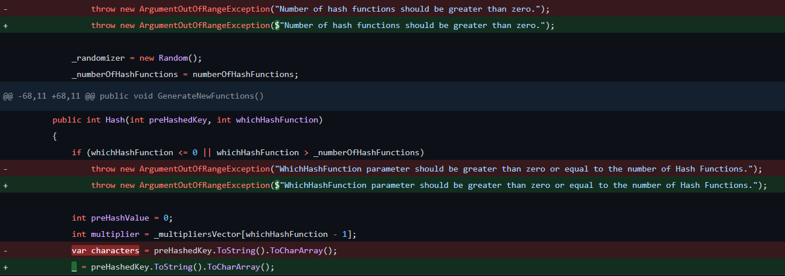

The variable was not used, so we removed it and inserted a discard instead.
- CuckooHashTable.cs 

## Errors addressing not specified exception and unecessary code complications

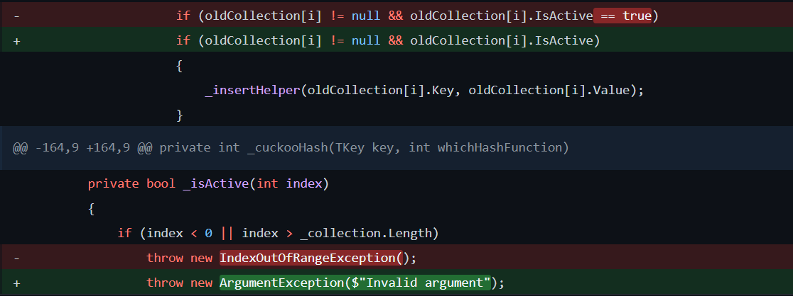

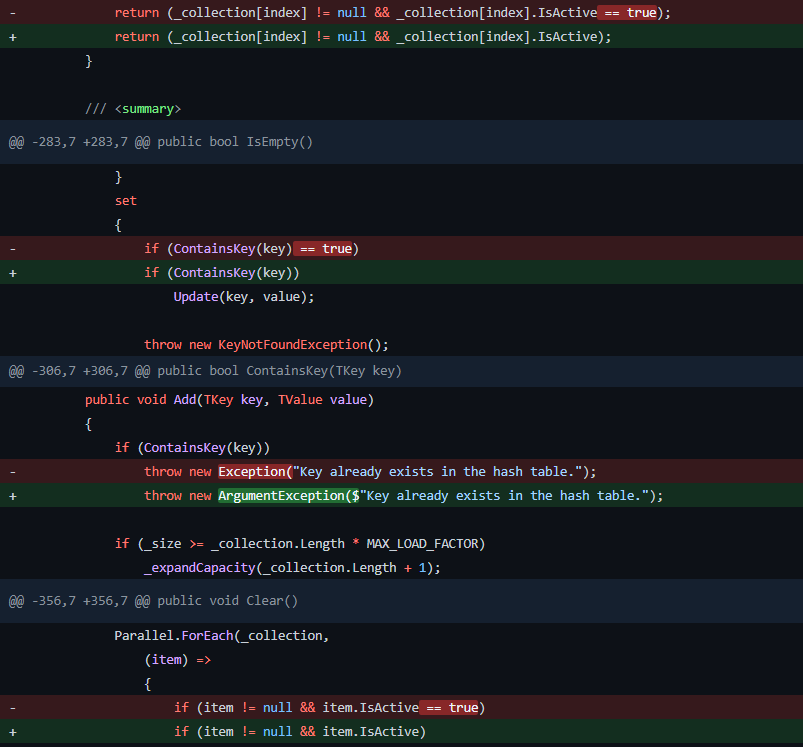

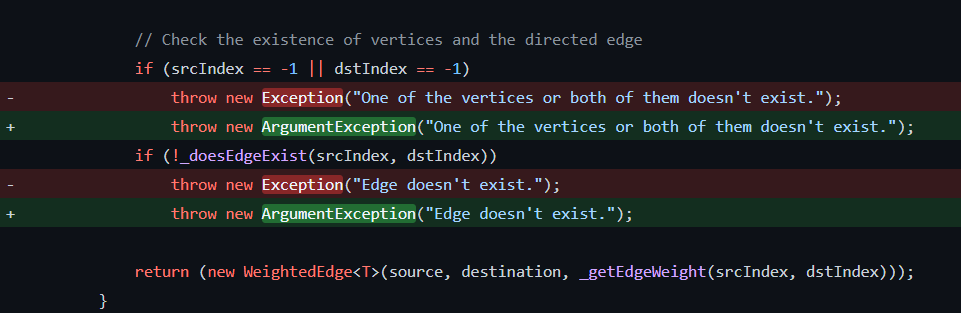

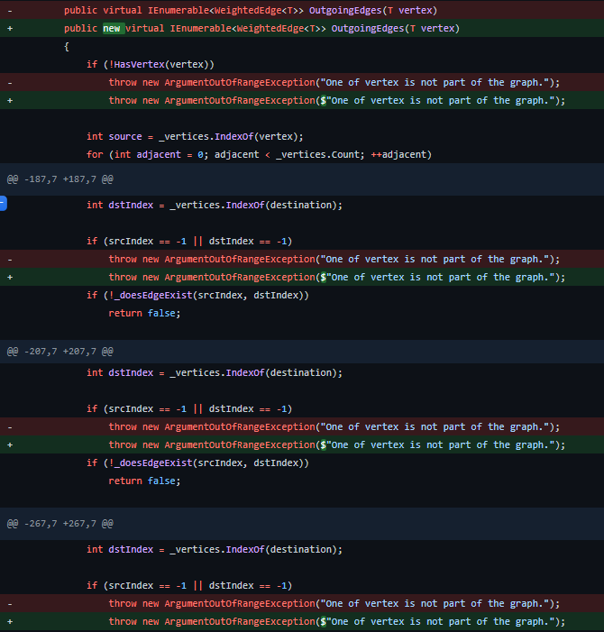

The thrown exceptions were not specific enough so we changed the type of the exception and gave it an explanation text. In 
the if expression there is no need to use bool Value == true.
- CuckooHashTable.cs 
- OpenAddressingHashTable.cs 
- UndirectedWeightedDenseGraph.cs 
- PrimeHashingFamily.cs 

## Wrong function naming and unecessary code complications

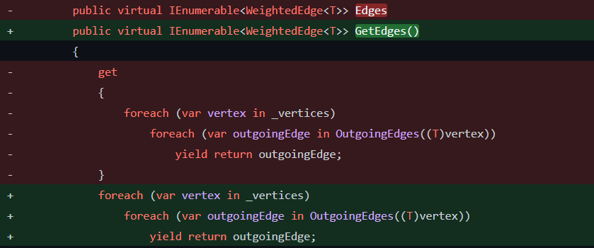

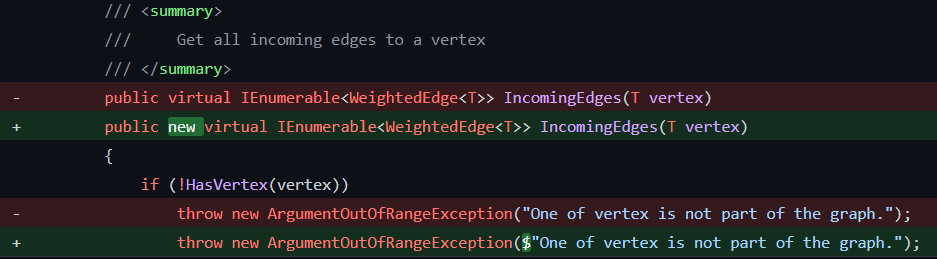

The naming of the function did not follow the functionality.
The IncomingEdges hides inherited member. To not let the current member override 
that implementation, we had to add new keyword.
- DirectedWeightedDenseGraph.cs 
- UndirectedWeightedDenseGraph.cs 
- GraphsDirectedWeightedDenseGraphTest.cs 

SonarLint suggested other issues concerning the syntax, but We discarded them, because they were not useful in the given context.
