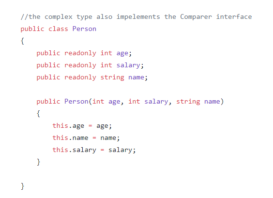
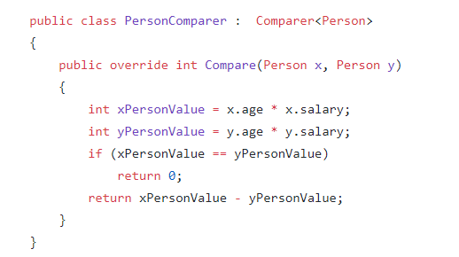

# Unit tests - enhance code coverage

The were many units tests already in the code, but still, lot of files had very low or even zero code coverage.
The task was to increase the coverage of some of these low coverage files.

A snippet of the coverage report, after cloning the project:


## Shortest paths algorithms

There are 3 shortest paths algorithms implemented in the project:

- Dijkstra
- Bellman-Ford
- Breadth first

Although all of them have the same interface (HasPathTo, DistanceTo, ShortestPathTo), only Dijkstra had a comprehensive test coverage. The task was to refactor `UnitTest/AlgorithmsTests/GraphsDijkstraShortestPathsTest.cs` tests to be executed on all three algorithms.

First, all the algorithm classes made to implement a new interface called `IShortestPath`:

```Csharp
public interface IShortestPath<TVertex>
{
    /// <summary>
    ///     Determines whether there is a path from the source vertex to this specified vertex.
    /// </summary>
    bool HasPathTo(TVertex destination);

    /// <summary>
    ///     Returns the distance between the source vertex and the specified vertex.
    /// </summary>
    long DistanceTo(TVertex destination);

    /// <summary>
    ///     Returns an enumerable collection of nodes that specify the shortest path from the source vertex to the destination vertex.
    /// </summary>
    IEnumerable<TVertex> ShortestPathTo(TVertex destination);
}
```

Then each test method got parameterized to execute the same test on the three different implementations:

```Csharp
[Theory]
[InlineData(ShortestPathAlgorithm.DIJKSTRA)]
[InlineData(ShortestPathAlgorithm.BELLMAN_FORD)]
[InlineData(ShortestPathAlgorithm.BREADTH_FIRST)]
public void Constructor_Throw_WhenSourceIsNotPartOfGraph(ShortestPathAlgorithm alg)
{
    var graph = new DirectedWeightedSparseGraph<string>();
    graph.AddVertex("a");
    graph.AddVertex("b");
    graph.AddVertex("c");
    graph.AddVertex("d");
    Assert.Throws<ArgumentException>(() => CreateAlgorithm(alg, graph, "x"));
}
```

Some tests are only executed on one or two of these implementations as not all of them support the same kind of graphs (Dijkstra does not support negative edges, BreadthFirst does not support weights). After executing the tests, several got failed: they were expecting `ArgumentException` but got `Exception`. After replacing all `Exception`s with `ArgumentException` (which made actually sense) two tests were still failing. They were two little bugs:

- BellmanFordShortestPaths initalized its `_edgeTo` array with wrong size, causing an `IndexOutOfRangeException`
- In _checkOptimalityConditions checking whether each edge is relaxed did not handle Infinity if a vertex had infinity distance

 After fixing these bugs, all tests executed successfully:

```diff
diff --git a/Algorithms/Graphs/BellmanFordShortestPaths.cs b/Algorithms/Graphs/BellmanFordShortestPaths.cs
index b921e7f..82c2bfc 100644
--- a/Algorithms/Graphs/BellmanFordShortestPaths.cs
+++ b/Algorithms/Graphs/BellmanFordShortestPaths.cs
@@ -127,7 +127,7 @@ namespace Algorithms.Graphs

             _distances = new Int64[_verticesCount];
             _predecessors = new int[_verticesCount];
-            _edgeTo = new WeightedEdge<TVertex>[_edgesCount];
+            _edgeTo = new WeightedEdge<TVertex>[_verticesCount];

             _nodesToIndices = new Dictionary<TVertex, int>();
             _indicesToNodes = new Dictionary<int, TVertex>();
```

```diff
diff --git a/Algorithms/Graphs/BellmanFordShortestPaths.cs b/Algorithms/Graphs/BellmanFordShortestPaths.cs
index 82c2bfc..a9fa169 100644
--- a/Algorithms/Graphs/BellmanFordShortestPaths.cs
+++ b/Algorithms/Graphs/BellmanFordShortestPaths.cs
@@ -187,7 +187,7 @@ namespace Algorithms.Graphs
                 {
                     int w = _nodesToIndices[edge.Key];

-                    if (_distances[v] + edge.Value < _distances[w])
+                    if (_distances[v] != Infinity && _distances[v] + edge.Value < _distances[w])
                     {
                         Console.WriteLine("edge " + vertex + "-" + edge.Key + " is not relaxed");
                         return false;
```

As a result the code was improved in several ways:
- More unit test coverage
- A bugfix in BellmanFordShortestPaths
- More consistency between shortest path algorithms (implementing the same interface, throwing the same type of exceptions)


## Open Addressing Hashtable

After running the code coverage analyzer on the project, we found out that the OpenAddressingHashTable algorithms were not tested at all. 
To ensure the quality and reliability of these algorithms we wrote unit tests. 
The unit tests are the following:

- AddValueToHashTableTest()


To make sure the initalization of this class works properly we instantiated this class, and tested the Count property

- HashSearchTest()


We were testing the search function of the hashTable, that returns the index of the of searched key.


- ExpandHashSizeTest()


We were initializing the hashTable with the length of two, and added 3 elements to the table to test if the expand feature works properly, so the table does not throw exeption and returns the expected length.

- IndexingHashTest()


We were testing the [] indexing operator of the hashTable, if it returns the expected value.

- RemoveTest()


We were testing the Remove() function of the class, by adding an element, removing it using the key, and then checking the length of the hashTable, if it is empty. 


- IndexElementExceptionTest()


After trying to assign value to a given key, which has not prevously been initialized the program throws a keynotfound exception. 


- ClearElementsTest()


We were testing the Clear() function of the class by adding several elements to the hashTable, and then clearing it, and checking if it is empty.


- ContainsElementTest()


We were testing the Contains() function of the class by adding an element to the hashTable, then creating another element with the same properties as the prevous element, and checking if the hashTable contains this element.


- TryGetValueTest()


We were testing the TryGetValue() function by adding an element to the hashTable, and calling the TryGetValue() function with the key of the added element, and checking if it returned true.


- AddElementStringKeyTest()


We were adding elements to the hashTable, that have string keys. We were testing if these elements were properly added.


- RemoveKeyTest()


We were testing the Remove() function of the class, by adding an element, removing it using the element, and then checking the length of the hashTable, if it is empty. 


## Sorting Algorithms

After running the code coverage analyzer on the project, we found out that the several sorting algorithms were not tested at all. To ensure the quality and reliability of these algorithms we wrote unit tests. 

We were testing three different sorting algorithms:
- CombSorter
- ShellSorter
- BucketSorter


We were testing both the Ascending and Descending functions of the three sorters.


## PrimeHashingFamily

After running the code coverage analyzer on the project, we found out that the PrimeHashingFamily algorithms were not tested at all. 
To ensure the quality and reliability of these algorithms we wrote unit tests. 
The unit tests are the following:

- CheckHashIdenticalInt()


We were testing if all the 5 implemented hashing algorithms gives the same deterministic hashed value for the given integer parameter. 


- CheckInvalidHashConstruction()


PrimeHashingFamily can not be initialized with 0 hashing algorithms, and we are expecting it to throw an exception.


- CheckInvalidHashFunction()


We were testing if using the 0. hashing algorithm throws an expected exception.


- CheckHashIdenticalString()


We were testing if all the 5 implemented hashing algorithms gives the same deterministic hashed value for the given string parameter. 


- CheckInvalidHashFunctionString()


We were testing if hashing algorithm throws an expected exception if we are hashing on null.


## SelectionSorter

This an other sorting algorithm which had 0% code coverage. It is a really small class so i thought it would be a good idea and also quite easy to achieve 100% code coverage
But instead of using somekind of built in primitive type like int or string for testing if the sorting is good, I created my own class type.

Because the algorithm I was about to test accept Generics types I tested it with my own type.
In order to this work I had to implement the ICompare interface in a different class for the Person class


I  tested both the Ascending and Descending functions of the sorter and both just worked fine with my own complex type.

